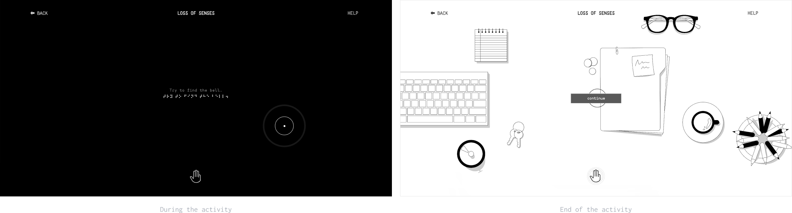

<!--- put all the images in an "images" folder --->


### Table of Contents
1. [The project](#the-project) <br>
  1a. [Idea](#idea) <br>
  1b. [Goals](#goals) <br>
  1c. [Context](#context) <br>
2. [Architecture](#architecture) <br>
  2a. [Experience 1](#experience-1) <br>
  2b. [Experience 2](#experience-2) <br>
  2c. [Experience 3](#experience-3) <br>
  2d. [Experience 4](#experience-4) <br>
3. [Design](#design) <br>
  3a. [Sounds](#sounds) <br>
  3b. [Interactions](#interactions) <br>
  3c. [Design challenges](#design-challenges) <br>
4. [Coding challenges](#coding-challenges) <br>
5. [References](#references) <br>
6. [Credits](#credits) <br>
7. [Team members](#team-members) <br>
8. [Course](#course) <br>

<!--- --------------------OK------------------------- --->

## The project
Loss of Senses is a web app that goes beyond the typical digital experience. It offers you, the user, the possibility to discover a new way of seeing, that doesn't rely on the eyes - or at least not your own. There is no darkness when there is communication. <br>

### Idea
It's a visual world and people respond to visuals. We live our life through different senses, but now more than ever we are all heavy consumers of visual content. <br>

More than a lot of our everyday activities, the interactions that we have with our electronic devices strongly rely on visuals and the use of sight. So, we mainly live the internet through our eyes. What if we weren’t given the possibility to use them? <br>

### Goals
Loss of Senses aims at proposing a different, innovative experience on the theme of blindness and on the more specific theme of "blind-interaction" with the digital world. The single experiences represent indeed the everyday challenges blind people have to face, or they address the thematic of assistance to blind people thanks to the collaboration between users. The website as a whole, on the other side, is itself an experience that represents a "blind-interaction" with the digital world. Loss of Senses wants to provide an uncommon, alternative, web experience, in which the sight loses power in favour of the hearing, and thus wants to show that there can be an alternative way of approaching the Internet, based on sounds rather than visuals. <br>

### Context
Loss of Senses is thought to be used as a Desktop app rather than on mobile in order to have a more fulfilling experience. It is suggested to anyone who wants to experience an alternative way of approaching the digital space without the use of the main sense usually involved, the sight. It could be also seen as a brief, limited and digital version of a more immersive and sensitive experience, like "Dialogo nel Buio". <br>

Since the key feature of the whole website is represented by the sound design, it would be preferable for the user to be in a quiet place where he can hear all the details of the audios. <br>

Moreover, an important part of the website is dedicated to shared experiences that require the collaboration between paired users. Hence, it is suggested to access the site in couples, in order to be sure to enjoy the complete experience. <br>

## Architecture
The first page of the website consists in a "transition page" necessary for the activation of the sounds when entering the real website. The next page welcomes the user and it provides a brief instruction on the functioning of the whole website. <br>


By proceeding, the user must choose between the "blind" and the "assistant" modality. This choice is functional to redirect the user to the map of the experiences he/she can access to, according to the selected modality. In both cases, the user will enter a page representing a map of the available experiences. In "blind mode" the user will be able to access all the experiences, two of which are collaborative. On the contrary, in "assistant mode" the user will be able to access only the collaborative experiences. The modality defines the role of the user in the experiences, and it can be changed whenever the user wants when he/she is on the experiences' map. <br>

The collaborative experiences pair up users who have selected different modalities two by two. When only a user has entered these experiences, he/she will have to wait in a waiting room for the other user to join, or can decide whether to try the non-collaborative experiences by selecting the "blind modality". <br>

In the single experiences, a button allows the user to get back to the map both during and at the end of them. <br>

### Experience 1
The first experience, carried out in blind modality, is a simple experience focused on environmental sounds recognition.
The user will have to guess for six rounds the origin of the sounds he will hear, by matching them with the corresponding labels. The sounds are recorded in different places all over the world, both in urban and natural contexts, so the user will need to pay attention to several details, including the language of the voices, the weather conditions etc... <br>

### Experience 2



The second experience is aimed at providing the user an everyday experience of blindness. The goal is to pat on a desk and find, among several objects casually placed, a target object, represented by a bell. The user will click all over the screen to attempts, and will hear different sounds according to the objects he will touch, including the desk itself. When the user finds the target object the experience is concluded and the image of the desk with all the objects in their position is displayed. <br>

### Experience 3
The third experience is a collaborative experience that involves users two by two, one in the role of the blind and the other in the role of the assistant. Hence, it can only be accessed when two users, who have selected complementary modalities, enter the activity at the same time. <br>

The aim for the blind user is getting out of a maze, by moving with the four arrows. He will see a completely dark screen except for a short radius circle around him (which represents the area scanned with a white cane), and he will need to be guided by the assistant, through sound signals. <br>

The assistant has, on the other hand, a full view on the maze and on the blind user movements, and leads him by positioning sounds sources when clicking on the screen. The sound signals guide the blind user thanks to the signals emitted: these are characterised by a certain frequency, which indicates in which direction the blind user should proceed, and by the frequency of the bleeps emitted (i.e. the number of bleeps in a fixed interval of time), which increases as the blind user approaches the sound source.<br>

### Experience 4
The fourth experience is very similar to the third one. The concept is exactly the same, i.e. one of the two users, the assistant, guides the blind user according to the aforementioned modality by positioning sound sources on the screen. <br>

However, the context is different: the aim for the blind is to cross a series of streets avoiding the vehicles. Hence he will need to proceed carefully, and the assistant will need to indicate him when to stop, when to proceed and in which direction. <br>

This experience represents a more common and everyday experience with respect to the maze, and the complexity is given by the presence of moving obstacles rather than a complicated path to follow.  <br>

## Design
Since the visual represents a secondary feature, its design in the website is kept as minimal and simple as possible. From the very first page, the website has a dark appearance, and the only constant decorative element are the braille texts, added for symbolic and aesthetic reasons. For the texts in latin alphabet a very minimal sans serif typeface was chosen. <br>

The key characteristic is represented by the fact that the website changes appearance according to the modality selected. Hence, when the "blind mode" is ON the website maintains its dark appearance, while in "assistant mode" the website switches to a white screen, opposite to the dark one. <br>

### Sounds
The sound design represents a key aspect of the whole web experience. The main objective was giving an idea to the user on how assistive technologies ( AT ) help blind people interacting with the screen. In order to do so, we replicated a screen reader, which is a common technology that renders text (and image) content as speech. Moreover, such screen reader is also the mean through which we try to obtain the most inclusive and accessible website as possible. For the same reason, each interaction of the user with the screen is accompanied by a sound (i.e. the clicking on buttons). <br>

Moreover, thanks to the screen reader, the non-blind user can try, by closing his/her eyes, to surf the website completely "in the dark", following the sound instructions. In this way we hope to raise awareness on the theme and provide a different, innovative point of view on digital experiences. <br>

Finally, the single experiences are characterised by very different sound designs: the first one is focused on environmental sounds. These recordings are rich of details, which are necessary in order to make the experience significant and to introduce a certain level of complexity. The second experience is focused on sounds of everyday objects, indeed the ones that can be commonly found on a desk. In the third and fourth experiences the main goal was the design of a sound signal that, emitted by the assistant, could actually guide the blind user throughout the activity. <br>

### Interactions
The main interactions of the user with the screen involve the use of buttons: when the user's cursor hovers on a button, the braille text switch to latin alphabet and the screen reader renders the content as speech. When he/she clicks on it, a beep sound is emitted. <br>

In many specific parts of the website, the interaction of the mouse with the screen leads to different graphic and sound effects. <br>

For what concerns the interactions between paired users in the 3rd and 4th experiences, the user in "assistant mode" communicates with the other user emitting the aforementioned sound signals.
On the other hand the blind user cannot communicate directly with the the assistant: however, his position will always be displayed to the him/her, who consequently decide how to guide him. <br>

### Design challenges
The greatest challenge was represented by the fact that while sight is the main sense involved in digital experiences, we had to adopt a sound approach rather than a visual one in the designing process of the website. Hence, we had to take care of the sound design in all its details, while for the visual side we had to find a good trade-off of a very minimal yet still pleasing design. Finally, due to the complex and rich structure of the website, taking care of every small aspect of each page resulted in a fairly large amount of work. <br>

## Coding challenges
In the developing process, we inevitably encountered a few difficulties when it was time to put ideas into code. Here are some of our major coding challenges and how we faced and solved them to achieve the final result:

- **Experience 2: scene setting** <br>
One of the main coding challenges of the experience 2 consists in randomly setting the objects on the table avoiding overlapping. To solve this issue we load the object images in an array and we progressively place them. We use two arrays to save the positions and the dimensions of the already placed objects.

  The center  coordinates of each placed object are computed relying on two functions:
  - “checkOverlaps (x,y)” checks that the point with coordinates (x,y) does not overlap with any of the objects already set;
  - “getXY (margin, i) “ returns the center coordinates of where to place the i-th object by checking that the center and the four edges of the i-th image are not overlapped with already set images. The margin parameter prevents objects to be placed on the canvas border.

```javascript
function checkOverlaps (x,y) {

  for (let i=0; i<itemsPosition.length; i++) {
    if (x > itemsPosition[i][0] - itemsDimensions[i][0]/2 &&
        x < itemsPosition[i][0] + itemsDimensions[i][0]/2 &&
        y > itemsPosition[i][1] - itemsDimensions[i][1]/2 &&
        y < itemsPosition[i][1] + itemsDimensions[i][1]/2) {
      return true;
    }
  }
  return false;
}

function getXY (margin, i) {
  let x;
  let y;
  let windowDiagonal = pow(pow(windowHeight,2)+pow(windowWidth,2),0.5);
  let scale = windowDiagonal*0.8 / (1280 / refs[i] * images[i].width);
  let w = images[i].width*scale;
  let h = w * images[i].height / images[i].width; //the height of the image always stays proportional to its width
  let overlapped =true;
  let j=0;
  while (overlapped) {
    x = floor(random(margin, windowWidth - margin));
    y = floor(random(margin, windowHeight - margin));
    if (!(checkOverlaps(x,y) ||
        checkOverlaps(x-w/2,y-h/2) || checkOverlaps(x-w/2,y+h/2) ||
        checkOverlaps(x+w/2,y-h/2) || checkOverlaps(x+w/2,y+h/2))) {
          overlapped = false;
    }
    j++;
    console.log(j);
  }
  return [x,y];
}

```

- **Experience 3/4: socket.io implementation** <br>
One of the main coding challenges of the experience 3 and 4 consists in properly take advantage of the socket.io library to set up the server-client structure.

  In particular both experiences 3 and 4 require the users to be matched in pairs.
  Without loss of generalization let’s focus on one of the two experiences.
  A user can be of 4 types: assistant-matched, blind-matched, assistant-unmatched, blind-unmatched.
  The server relies on arrays to keep track of matched and unmatched users.
  When a new user connects, the server go through the unmatched-array to possibly create pairs.
  When a new pair is made, the unmatched-array is updated and the the new pair is pushed into the matched-array.

  If the experience ends the winning pair is removed from the matched-array.
  If a disconnection happens both the matched and the unmatched array are checked.
  In the case the disconnection affected a matched users, its mate is disconnected too and redirected to the menu.
  In the case the disconnection affected an unmatched-user nothing happens.
  In both cases the corresponding arrays are updated.

```javascript
 socket.on("welcome", function (dataReceived){

    // #############
    if (dataReceived.room == "labyrinth") {
        room="labyrinth";
        let matched = false;
        let index=NaN;
        //blind side
        if (dataReceived.side == "blind") {
          console.log("labyrinth blind socket:", socket.id);
          side="blind";
          // If there is someone waiting then I pair them
          for (let i = 0; i < labyrinth.length; i++) {
            if (labyrinth[i].blind == undefined) {
              labyrinth[i].blind = socket.id;
              matched = true;
              index = i;
              break;
            }
          }
          // Otherwise i create a new lobby
          if (!matched) {
            let el = { blind: socket.id}
            labyrinth.push(el);
          }
        }
        //sighted side
        if (dataReceived.side == "sighted") {
          console.log("labyrinth sighted socket:", socket.id);
          side="sighted";
          // If there is someone waiting then I pair them
          for (let i = 0; i < labyrinth.length; i++) {
            if (labyrinth[i].sighted == undefined) {
              labyrinth[i].sighted = socket.id;
              matched = true;
              index = i;
              break;
            }
          }
          // Otherwise i create a new lobby
          if (!matched) {
            let el = { sighted: socket.id}
            labyrinth.push(el);
          }
        }
        //If matched, start the experience
        if (matched) {
          io.to(labyrinth[index].blind).emit("start", labyrinth[index].sighted);
          io.to(labyrinth[index].sighted).emit("start", labyrinth[index].blind);
          labyrinthMain.push(labyrinth[index]); //add pair to the main lobby
          labyrinth.splice(index,1); //delete pair from the queue
        }
      }

```

- **title** <br>

```javascript

  //qui il codice

```

## References
[Dialogo nel Buio](https://www.dialogonelbuio.org/index.php/it/) -
The starting idea that led to the development of the project drew inspiration from the awareness raising exhibition Dialogo nel Buio ("Dialogue in the Dark"). <br>

[Trip in the dark](https://tripinthedark.ru/en/) -
Source of inspiration as a website that can be experienced through different senses. <br>

[The Coding Train](https://thecodingtrain.com/) -
Bless Daniel Shiffman for the best instructional videos on how to program with p5.js. Always helpful no matter what. <br>

[W3Schools](https://www.w3schools.com/) -
Online tutorials on HTML and CSS have never been more useful. <br>

## Credits
[P5js](https://p5js.org/) -
The JavaScript library that we used to develop all the main graphics in our website, thanks to the coding techniques we learned during the course. <br>

[P5.sound](https://p5js.org/reference/#/libraries/p5.sound) -
The p5.sound library extends p5 with Web Audio functionality and was largely used in the whole website. <br>

[P5.speech](https://idmnyu.github.io/p5.js-speech/) -
The p5.speech library is a simple p5 extension to provide Web Speech (Synthesis and Recognition) API functionality, and was used to to simulate the speech reader assistive technology. <br>

[Heroku](https://www.heroku.com/) -
The cloud platform we used to publish the website, through GitHub. <br>

[Ahamono](https://www.behance.net/gallery/19532783/AhamonoMonospaced) -
The typeface we used for the whole website, by Alfredo Marco Pradil. <br>

[Zasplat](https://www.zapsplat.com/) -
The website we used to freely download sound effects. <br>

## Team members
* [Jean Paul Guglielmo Baroni](https://github.com/jpgbaroni)
* [Chiara Caputo](https://github.com/chcapu)
* [Maurizio Cerisola](https://github.com/MaurizioCerisola)
* [Chiara Cozzarini](https://github.com/chiaracozzarini)

## Course:
[Creative Coding 2020/2021](https://drawwithcode.github.io/2020/)<br>
**Politecnico di Milano** - Scuola del Design<br>
**Faculty:** Michele Mauri, Tommaso Elli, Andrea Benedetti
